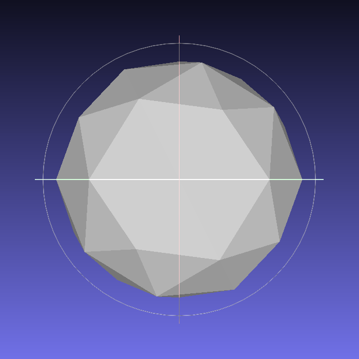
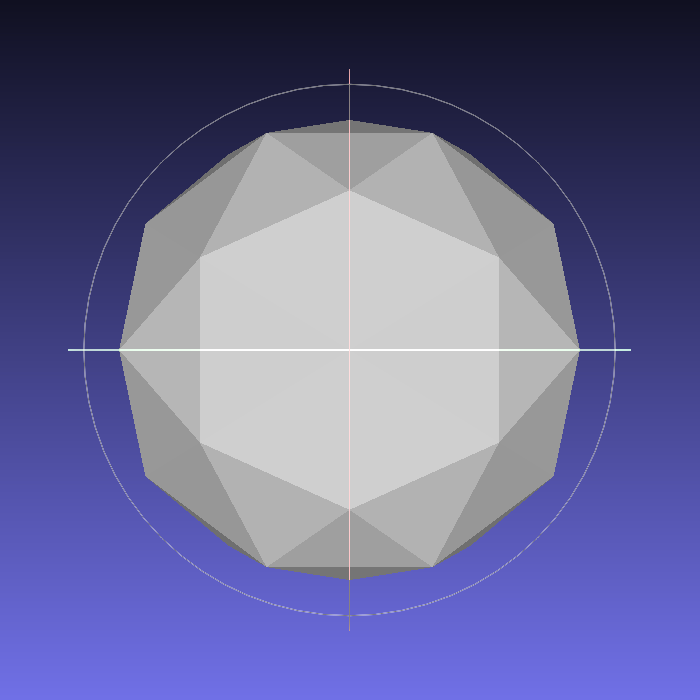

# icosphere

    
    

### References

https://blog.coredumping.com/subdivision-of-icosahedrons/

##### blender    
    
    

##### three

https://github.com/mrdoob/three.js/blob/master/src/geometries/IcosahedronGeometry.js

    
    

##### oF    
https://github.com/darrenmothersele/openFrameworks/blob/master/3d/ofMesh.cpp#L1770

    
    
